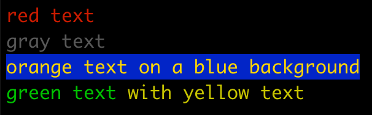
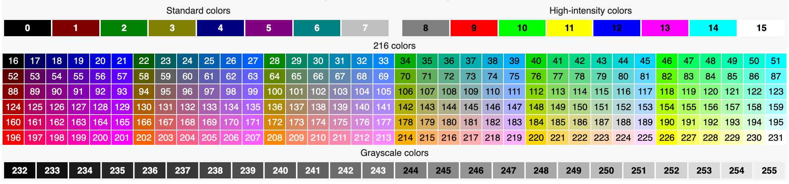

# go-color
go-color is a simple color library for Go that allows you to print colored text for the Unix terminal.

# Installation

```bash
go install github.com/ermanimer/go-color
```

# Usage

```go
// use predefined colors
color.Red.Println("red text")

// create colors with color codes, see the color chart below.
color.New(240).Println("gray text")

// add background color
color.New(220).With(color.Blue).Println("orange text on a blue background")

// create colored strings
fmt.Printf("%s %s\n", color.Green.Paint("green text"), color.Yellow.Paint("with yellow text"))
```

**Output**




**Color Codes:**



# Contribution

Your contribution and feedback are always welcome.

# References

[ANSI Escape Code](https://en.wikipedia.org/wiki/ANSI_escape_code)
